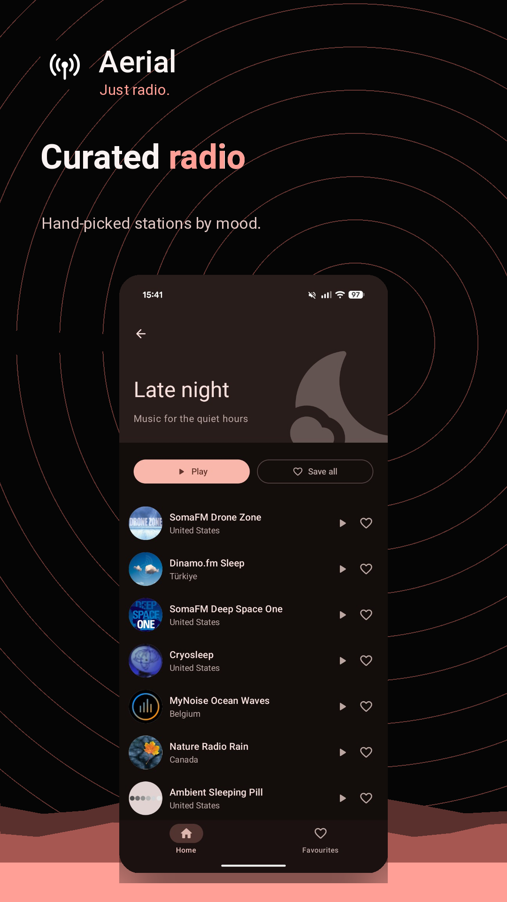
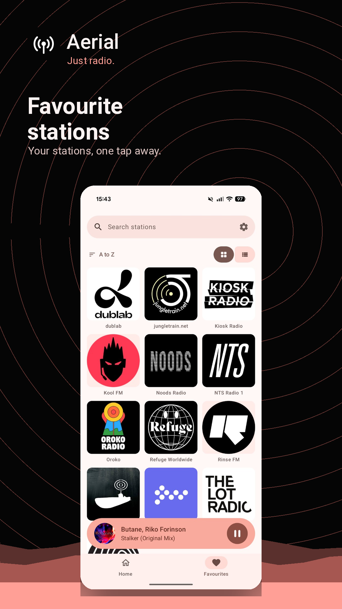
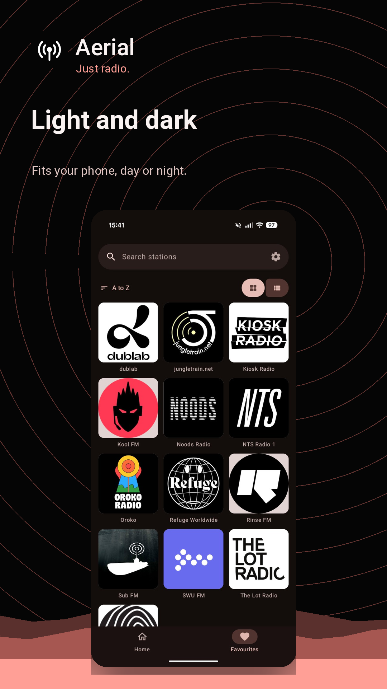
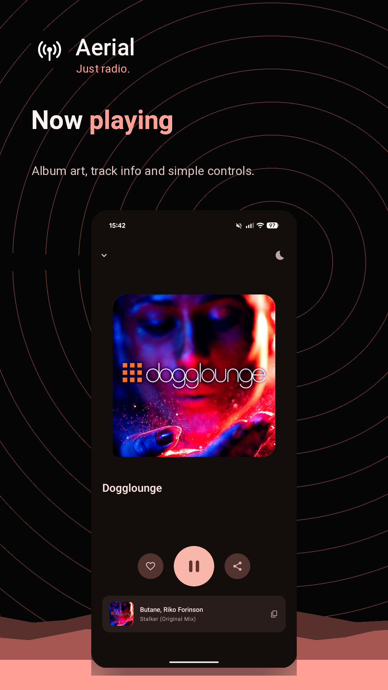
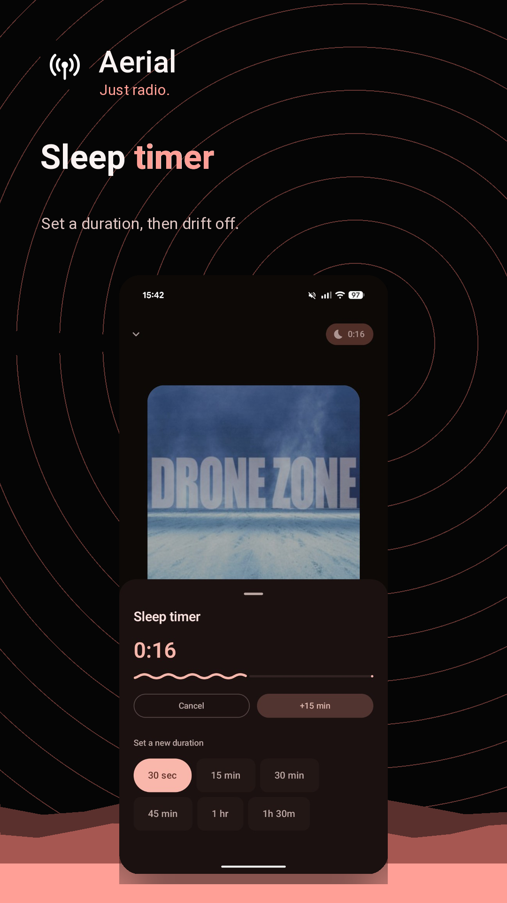

# Aerial

Aerial is a lightweight Android radio player.

## Install

## Screenshots

  
  
  
  
  

## Features

- Explore curated radio collections for different moods and listening moments.
- Save favorite stations and keep them close in a simple home view.
- Play live radio with artwork, track details, and Android media controls when available.
- Set a sleep timer so playback stops automatically.
- Keep listening privately with no ads, analytics, tracking SDKs, Firebase, or accounts.

## Support

Enjoying Aerial? If you would like to support the project, you can buy me a
coffee or send a small contribution through Ko-fi or PayPal. Support is
optional, but it helps with the time and costs involved in keeping Aerial
maintained.

  
  &nbsp;&nbsp;
  
  &nbsp;&nbsp;
  

## Development

Developer documentation lives in [DEVELOPERS.md](DEVELOPERS.md). See
[CONTRIBUTING.md](.github/CONTRIBUTING.md) for how to propose changes, and
[SECURITY.md](.github/SECURITY.md) to report a vulnerability privately.

## Privacy

Aerial does not include advertising, analytics, tracking SDKs, Firebase,
Crashlytics, Google Play Services, or user accounts. See [PRIVACY.md](PRIVACY.md)
for the full privacy policy.

## License

Aerial is licensed under the Apache License, Version 2.0. See `LICENSE`.
