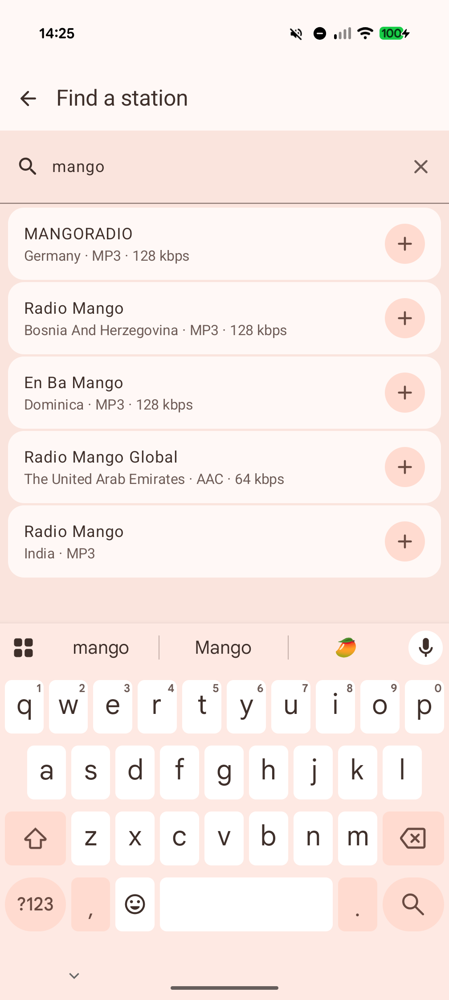
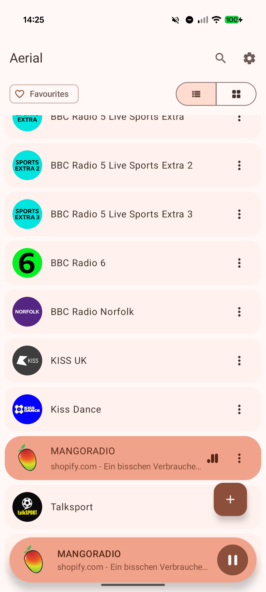
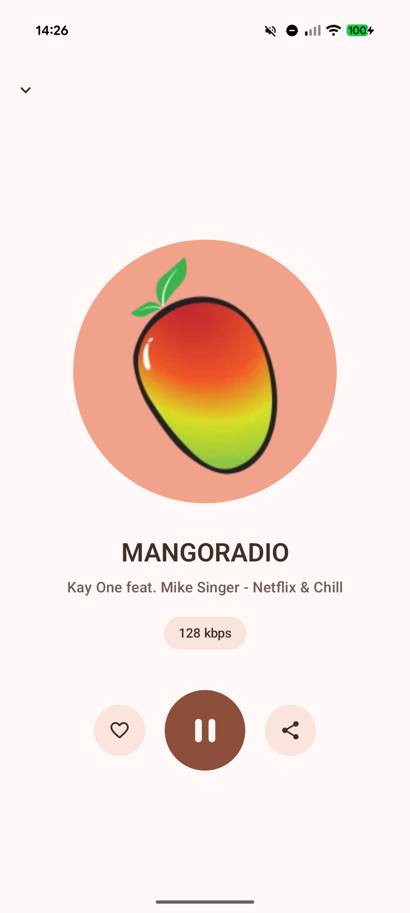
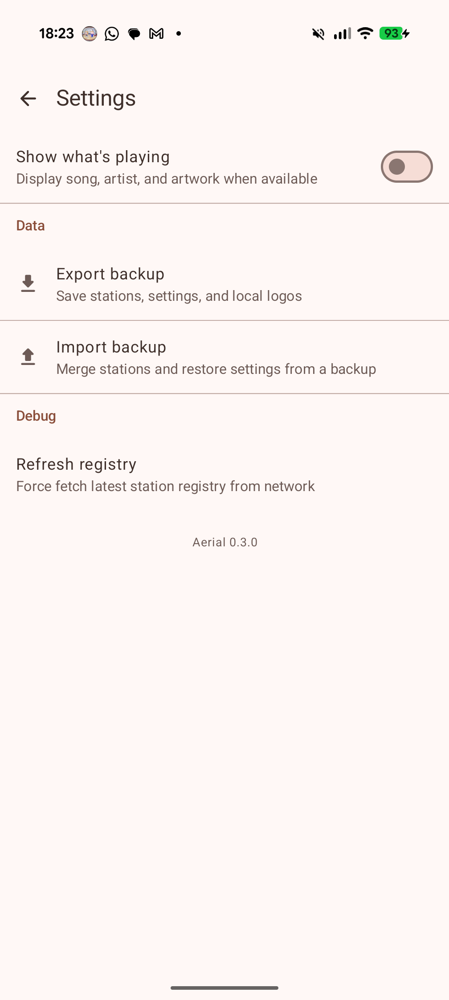
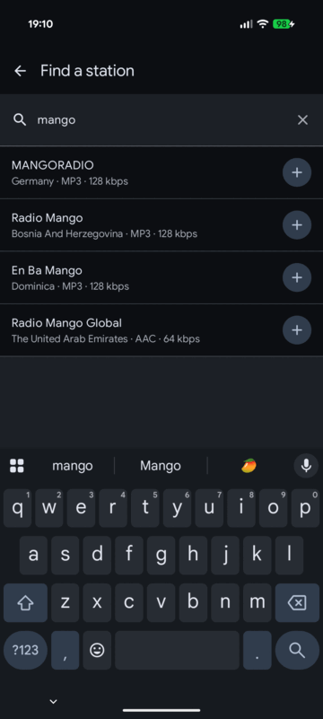
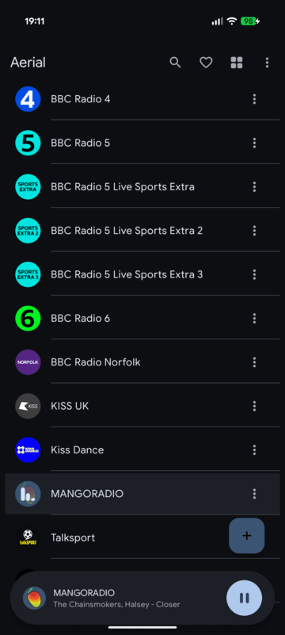
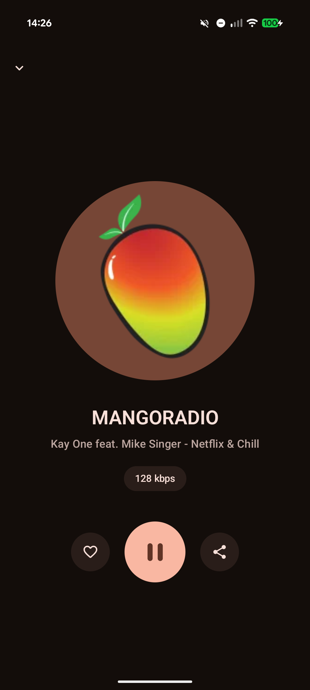
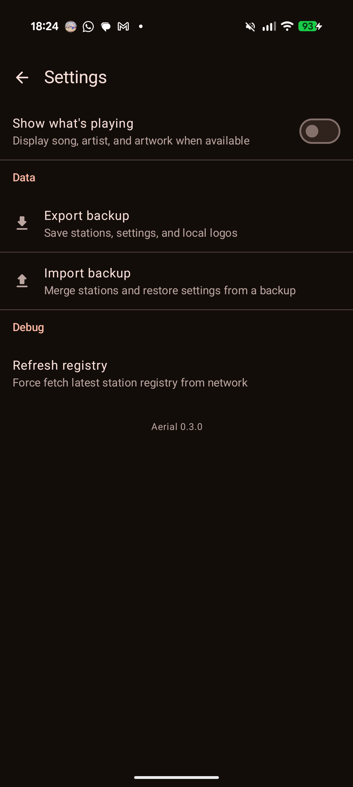

# Aerial

Aerial is a lightweight Android radio player.

## Install

## Screenshots

Light mode:

  
  
  
  

Dark mode:

  
  
  
  

## Features

- Discover stations from the Aerial registry with featured stations, country and genre filters, and quick genre playback.
- Add stations manually when a stream URL is known.
- Play live streams with Android media controls.
- Save and browse favorite stations as home screen tiles.
- Show song, artist, and artwork when stations provide playback details.
- Store station logos locally for faster loading.
- Export and import stations and saved logos as a zip backup.
- Adaptive launcher icon with Android themed icon support.

## Development

Developer documentation lives in [DEVELOPERS.md](DEVELOPERS.md).

## Privacy

Aerial does not include advertising, analytics, tracking SDKs, Firebase,
Crashlytics, Google Play Services, or user accounts. See [PRIVACY.md](PRIVACY.md)
for the full privacy policy.

## License

Aerial is licensed under the Apache License, Version 2.0. See `LICENSE`.
